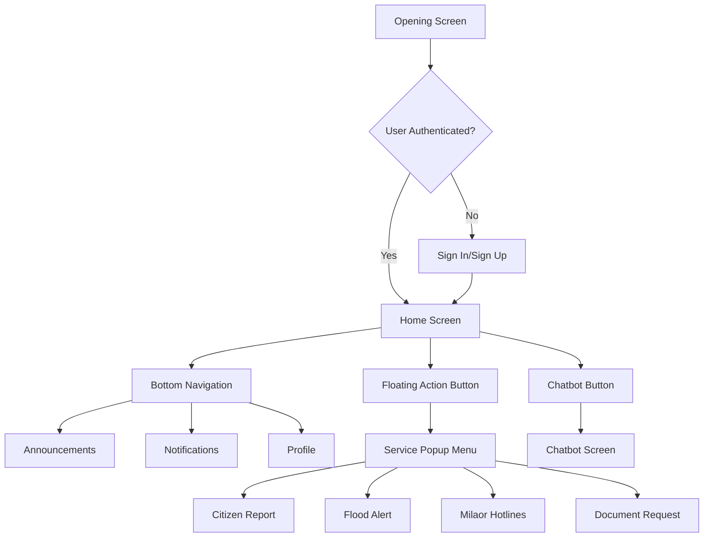

# Milaud Mobile App - Architecture Plan

## Overview
A participatory governance information system for Milaor residents with features for announcements, notifications, profile management, chatbot assistance, and service requests.

## App Architecture

### Navigation Structure
```
Main App
├── Authentication Flow
│   ├── Opening Screen
│   ├── Sign In
│   ├── Sign Up
│   └── OTP Verification
│
├── Main App (After Login)
│   ├── Home Screen (Dashboard)
│   │   ├── Welcome Banner
│   │   ├── Quick Actions Grid
│   │   ├── Flood Monitoring Card
│   │   ├── Latest Announcements
│   │   └── Floating Chatbot Button
│   │
│   ├── Announcements Screen
│   │   ├── Announcement List
│   │   ├── Announcement Details
│   │   └── Filter by Category
│   │
│   ├── Notifications Screen
│   │   ├── Notification List
│   │   ├── Mark as Read
│   │   └── Clear All
│   │
│   ├── Profile Screen
│   │   ├── User Info
│   │   ├── Settings
│   │   ├── Document History
│   │   └── Logout
│   │
│   └── Service Screens (via FAB Popup)
│       ├── Citizen Report
│       ├── Flood Alert
│       ├── Milaor Hotlines
│       └── Document Request
│
└── Chatbot Interface
    ├── Chat History
    ├── Quick Questions
    └── File Attachments
```

### Screen Components

#### 1. Home Screen (`home.dart`)
- **Header**: User greeting with profile icon
- **Welcome Banner**: Personalized greeting with app description
- **Quick Actions Grid**: 4-action grid (Report Issue, Request Document, Hotlines, Chat with Mila)
- **Flood Monitoring Card**: Real-time river status with visual indicator
- **Latest Announcements**: Horizontal scrollable announcement cards
- **Bottom Navigation**: Home, Announcements, Notifications, Profile
- **Floating Action Button**: + button with service popup menu
- **Chatbot Integration**: Floating button on side for quick access

#### 2. Announcements Screen (`announcement.dart`)
- Already exists but needs enhancement
- List view of announcements with images
- Filter by categories (Health, Public Notice, Events, etc.)
- Search functionality
- Bookmark/Share options

#### 3. Notifications Screen (`notifications.dart` - to be created)
- List of user notifications
- Group by date (Today, Yesterday, This Week)
- Actionable notifications (with buttons)
- Badge count in bottom nav

#### 4. Profile Screen (`profile.dart` - to be created)
- User avatar and personal info
- Account settings
- Document request history
- App preferences
- Logout button

#### 5. Service Screens
- **Citizen Report**: Form to report issues with location, photos
- **Flood Alert**: Emergency alert system with severity levels
- **Milaor Hotlines**: Contact directory for emergency services
- **Document Request**: Request barangay clearance, certificates

### Data Flow
```
User Input → API Service → Backend → Database
      ↓
Local Storage (SharedPreferences)
      ↓
UI State Management (Provider/Bloc)
```

### State Management Approach
Given the project size, recommend using **Provider** for state management:
- User authentication state
- Announcements data
- Notifications state
- Profile information
- Chatbot conversation

### Responsive Design Strategy
1. **ScreenUtil** already integrated for responsive sizing
2. **MediaQuery** for dynamic layout adjustments
3. **Flexible** and **Expanded** widgets for fluid layouts
4. **Orientation** awareness for landscape/portrait
5. **Breakpoint-based** layouts for tablets

### File Structure Enhancement
```
lib/
├── core/                    # Core utilities
│   ├── app_layout.dart
│   ├── app_text.dart
│   ├── responsive.dart
│   └── spacing.dart
│
├── models/                 # Data models
│   ├── announcement.dart
│   ├── notification.dart
│   ├── user.dart
│   └── service_request.dart
│
├── services/              # API services
│   ├── api_service.dart
│   ├── auth_service.dart
│   └── notification_service.dart
│
├── providers/             # State providers
│   ├── auth_provider.dart
│   ├── announcement_provider.dart
│   └── notification_provider.dart
│
├── screens/              # Screen widgets
│   ├── home/            # Home screen and components
│   ├── announcements/   # Announcement screens
│   ├── notifications/   # Notification screens
│   ├── profile/         # Profile screens
│   ├── services/        # Service request screens
│   └── chatbot/         # Chatbot interface
│
└── widgets/             # Reusable widgets
    ├── custom_app_bar.dart
    ├── service_card.dart
    ├── announcement_card.dart
    └── responsive_grid.dart
```

### Integration Points
1. **Authentication**: Connect existing sign-in/sign-up screens to home
2. **Navigation**: Implement proper routing between screens
3. **Chatbot**: Integrate existing chatbot screen with floating button
4. **Services**: Connect FAB popup to respective service screens
5. **Responsive**: Ensure all screens work on various device sizes

### Mermaid Diagram: App Navigation Flow


### Implementation Priority
1. **Phase 1**: Enhance home.dart with complete features
2. **Phase 2**: Implement bottom navigation with working screens
3. **Phase 3**: Create service screens and connect to FAB
4. **Phase 4**: Build notifications and profile screens
5. **Phase 5**: Integrate responsive design across all screens
6. **Phase 6**: Connect to backend APIs (mock data first)

### Success Metrics
- All features mentioned in requirements are implemented
- App works responsively on various screen sizes
- Navigation is intuitive and smooth
- User can access all services via FAB popup
- Chatbot is accessible from home screen
- Notifications and announcements display properly