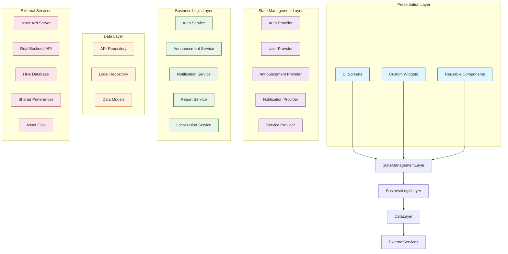
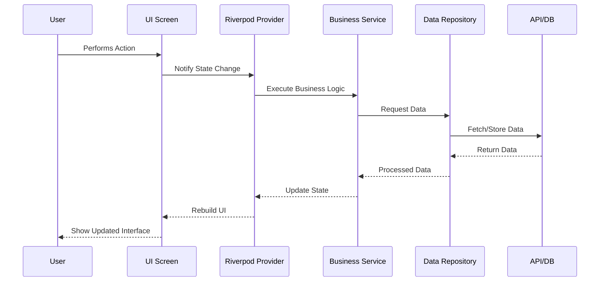
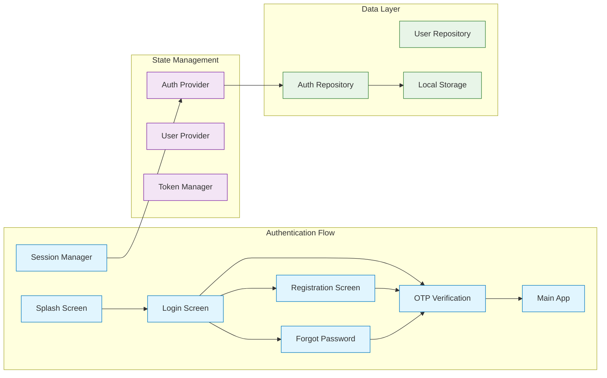
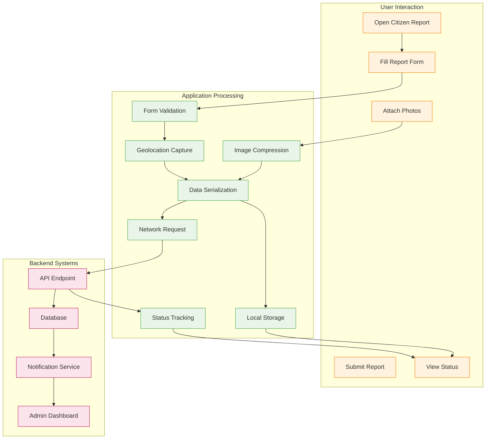

# Milaud Mobile App - System Architecture

## Overall Architecture Diagram



## Component Interaction Flow



## Authentication Flow Architecture



## Data Flow for Citizen Report



## File Structure Organization

```
lib/
├── main.dart
├── theme/                    # Design System
│   ├── app_theme.dart
│   ├── color_palette.dart
│   ├── typography.dart
│   ├── spacing.dart
│   └── shadow.dart
├── providers/               # Riverpod Providers
│   ├── auth_provider.dart
│   ├── user_provider.dart
│   ├── announcement_provider.dart
│   ├── notification_provider.dart
│   └── service_provider.dart
├── services/               # Business Logic
│   ├── api_service.dart
│   ├── auth_service.dart
│   ├── announcement_service.dart
│   ├── notification_service.dart
│   └── report_service.dart
├── repositories/           # Data Access
│   ├── auth_repository.dart
│   ├── announcement_repository.dart
│   ├── user_repository.dart
│   └── local_repository.dart
├── models/                 # Data Models
│   ├── user_model.dart
│   ├── announcement_model.dart
│   ├── notification_model.dart
│   └── report_model.dart
├── screens/               # UI Screens
│   ├── auth/
│   ├── home/
│   ├── announcements/
│   ├── notifications/
│   ├── profile/
│   └── services/
├── components/            # Reusable Widgets
│   ├── buttons/
│   ├── cards/
│   ├── dialogs/
│   ├── loaders/
│   └── empty_states/
├── utils/                 # Utilities
│   ├── validators.dart
│   ├── formatters.dart
│   ├── constants.dart
│   └── helpers.dart
└── data/                  # Static Data
    ├── milaor_data.dart
    ├── barangays.dart
    └── emergency_contacts.dart
```

## Technology Stack

| Layer | Technology | Purpose |
|-------|------------|---------|
| **UI Framework** | Flutter 3.0+ | Cross-platform mobile development |
| **State Management** | Riverpod 2.0 | Predictable state management |
| **Networking** | Dio 5.0 | HTTP client with interceptors |
| **Local Storage** | Hive 3.0 | NoSQL database for offline data |
| **Preferences** | Shared Preferences 2.0 | Simple key-value storage |
| **Animations** | Flutter Animate 4.0 | Smooth UI animations |
| **Images** | Cached Network Image 3.0 | Image caching and loading |
| **SVG** | Flutter SVG 2.0 | Vector graphics support |
| **Testing** | Flutter Test | Unit and widget testing |
| **Linting** | Flutter Lints 6.0 | Code quality enforcement |

## Key Design Decisions

1. **Riverpod over Provider/Bloc** - Better testability, no BuildContext dependency
2. **Clean Architecture** - Separation of concerns, testable business logic
3. **Mock API First** - Development without backend dependency
4. **Offline-First** - Local storage for all critical data
5. **Accessibility First** - WCAG compliance from start
6. **Material 3** - Modern design system with dynamic color
7. **Responsive Design** - flutter_screenutil for consistent scaling

## Performance Considerations

1. **Image Optimization** - Compress assets, use WebP format
2. **Lazy Loading** - Pagination for lists, deferred image loading
3. **Memory Management** - Dispose controllers, avoid memory leaks
4. **Build Optimization** - Const constructors, extracted widgets
5. **Network Optimization** - Request caching, compression

## Security Measures

1. **Token Storage** - Secure storage with flutter_secure_storage
2. **Input Validation** - Client-side validation for all forms
3. **HTTPS Only** - All API calls over secure connection
4. **Data Encryption** - Sensitive data encryption at rest
5. **Session Management** - Automatic token refresh, logout on expiry

---

*This architecture ensures a scalable, maintainable, and testable codebase that can evolve from a defense presentation project to a production-ready application for Milaor residents.*